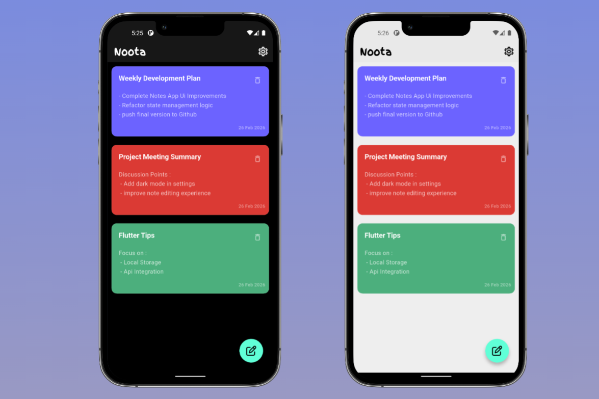
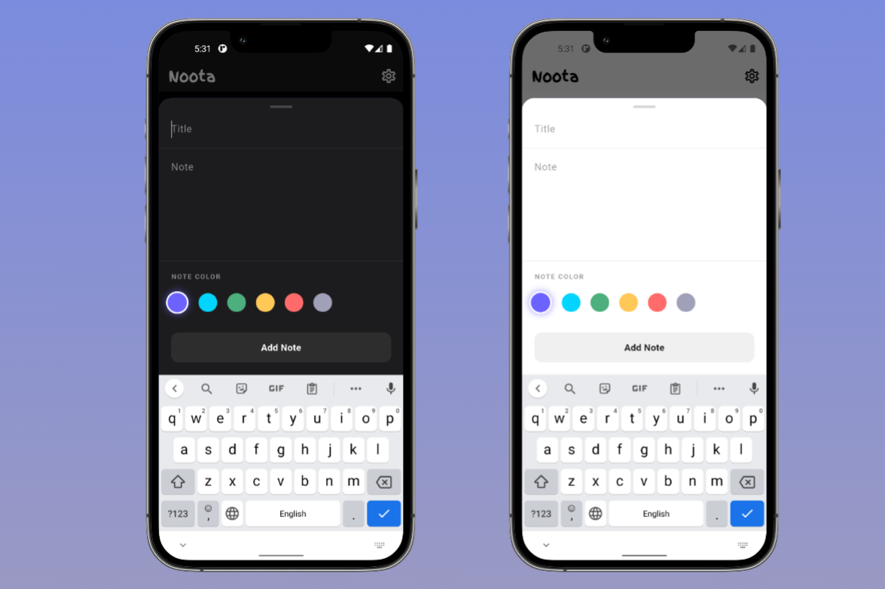
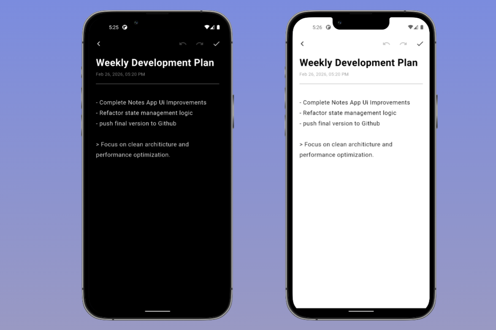

# 📝 NoteFlow

Organize your thoughts. Capture your ideas.

A clean and modern note-taking application that allows users to create, edit, delete, and manage notes efficiently — with smooth navigation and a beautiful UI experience.

---

## 📱 App Overview

NoteFlow helps you:

- ✍️ Create new notes
- 📝 Edit existing notes
- 🗑 Delete notes
- 👁 View note details
- 🌗 Switch between Light & Dark mode
- 💾 Store notes locally

---

## 📸 Screenshots

### 🏠 Home Screen

Displays all saved notes in a clean card layout.

---

### ✍️ Write Note Screen

Create a new note by adding a title and detailed content.

---

### 👁 Note Details Screen

View the full note content with options to edit or delete.

---

## 🚀 Features

- Add Notes with Title & Content  
- Edit Notes Anytime  
- Delete Notes Instantly  
- Persistent Local Storage  
- Clean & Minimal UI  
- Smooth Navigation Between Screens  
- Light & Dark Theme Toggle  
- Responsive Design  

---

## 🛠 Tech Stack

- Flutter  
- Local Database (Hive)  
- State Management  
- Clean Architecture  
- Material Design  
